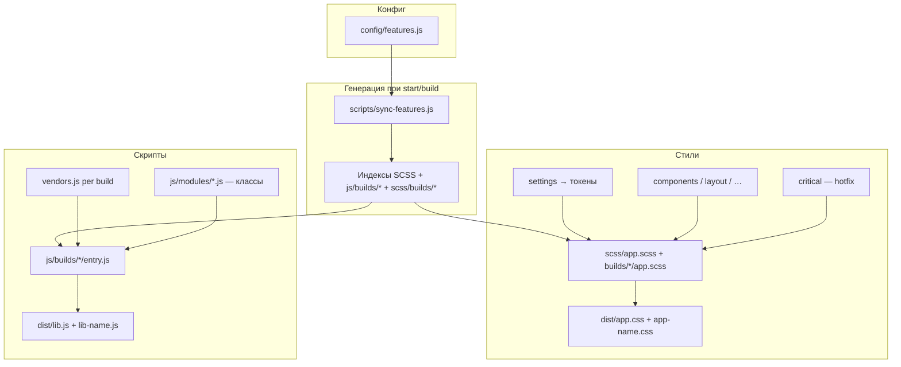

# lite-foundation

Лёгкий UI-стартер в духе [Foundation for Sites](https://get.foundation/), без npm-пакета `foundation-sites`: свои SCSS-слои, JS-классы, feature-флаги и CSS-токены `--lf-*`.

**Репозиторий:** [github.com/siverus21/lite-foundation](https://github.com/siverus21/lite-foundation)

---

## Навигация

- [Стек](#стек)
- [Быстрый старт](#быстрый-старт)
- [Команды](#команды)
- [Архитектура](#архитектура)
  - [Общая схема](#общая-схема)
  - [SCSS-слои](#scss-слои)
  - [JavaScript](#javascript)
  - [Сборка](#сборка)
  - [Feature-флаги](#feature-флаги)
  - [Named builds](#named-builds)
  - [Library builds](#library-builds)
  - [JS lifecycle](#js-lifecycle)
- [Дизайн-токены](#дизайн-токены)
  - [Цвета](#цвета)
  - [Z-index](#z-index)
  - [Lint токенов](#lint-токенов)
- [Как добавлять код](#как-добавлять-код)
  - [Новый SCSS-компонент](#новый-scss-компонент)
  - [Новый JS-модуль](#новый-js-модуль)
  - [Vendors](#vendors)
  - [Выключить ненужное](#выключить-ненужное)
  - [Критичные правки](#критичные-правки-scsscritical)
- [Сторонние библиотеки](#сторонние-библиотеки)
  - [Куда что класть](#куда-что-класть)
  - [Пример: lightbox (GLightbox)](#пример-lightbox-glightbox)
  - [Нюансы](#нюансы)
- [Каталог компонентов](#каталог-компонентов)
- [Структура репозитория](#структура-репозитория)
- [Соглашения](#соглашения)
- [Подключение в проект](#подключение-в-проект)
- [Демо и документация](#демо-и-документация)

---

## Стек

| Технология | Роль |
|------------|------|
| **Vite 6** | Dev-сервер (HMR); production — `scripts/build.js` (named builds) |
| **Sass** | Многослойная архитектура → `dist/app.css`, `app-{name}.css`, `lib-{name}.css` |
| **Cash** | Опционально, бандлится в JS (`window.$`) — лёгкая замена jQuery без ajax |
| **Swiper 11** | Отдельный library-бандл `lib-swiper.css` / `lib-swiper.js` |
| **Animate.css 4** | Fade-анимации (только CSS через vendors) |

Требования: **Node.js 18+**, npm.

---

## Быстрый старт

```bash
git clone https://github.com/siverus21/lite-foundation.git
cd lite-foundation
npm install
npm run start
```

Откроется kitchen-sink: [`index.html`](index.html) — живые примеры + карта ссылок на docs у каждой секции.  
Документация с разметкой для копирования: [`docs/`](docs/index.html).  
Минимальный named build (отдельный UI): [`about.html`](about.html) → `app-about.css` / `lib-about.js`.

Production-сборка:

```bash
npm run build
```

Артефакты (плоский `dist/`, по ключам в `builds`):

```text
dist/
  app.css          # full (kitchen-sink, без Swiper)
  lib.js
  app-about.css    # builds.about
  lib-about.js
  lib-swiper.css   # builds.swiper (kind: library)
  lib-swiper.js
  *.map
```

В конце сборки — `token lint`, `✓ build ok` и размеры всех бандлов (raw + gzip).

---

## Команды

| Команда | Описание |
|---------|----------|
| `npm run start` / `npm run dev` | Vite dev-сервер + HMR |
| `npm run build` | Production: все named builds → `dist/app*.css` + `dist/lib*.js` |
| `npm run test` | Vitest: core + модули + features |
| `npm run sync:features` | Пересобрать индексы из `config/features.js` вручную |
| `npm run lint:tokens` | Проверить хардкод цветов / z-index; напомнить про `critical/` |

---

## Архитектура

### Общая схема



**Идея:** один источник правды — [`config/features.js`](config/features.js) (`export default` + `builds`). Из него генерируются списки `@import` и JS-модулей. Выключенный флаг = код не попадает в соответствующий бандл.

### SCSS-слои

Порядок в [`scss/app.scss`](scss/app.scss) (сверху вниз):

| # | Слой | Путь | Назначение |
|---|------|------|------------|
| 1 | Abstracts | `scss/abstracts/` | `rem-calc`, breakpoint-миксины, функции (без CSS-вывода) |
| 2 | Settings | `scss/settings/` | Sass-переменные + эмит `:root { --lf-* }` |
| 3 | Base | `scss/base/` | Reset, типографика |
| 4 | Vendors | `scss/vendors/` | Swiper / Animate.css (по флагам) |
| 5 | Layout | `scss/layout/` | Grid, containers; опционально title-bar / top-bar |
| 6 | Components | `scss/components/` | UI-компоненты (по флагам `styles.*`) |
| 7 | Utilities | `scss/utilities/` | Flex / visibility helpers |
| 8 | Critical | `scss/critical/` | Срочные оверрайды (последними, без token-lint) |

**Паттерн компонента:** папка = компонент.

```text
scss/settings/button/     → Sass-токены ($button-…)
scss/components/button/   → CSS (.button, .button-group, …)
```

Каждая папка имеет `_index.scss`, который тянет partials. Корневые `_index.scss` слоёв **генерируются** — руками не править.

### JavaScript

| Файл | Роль |
|------|------|
| [`js/builds/{name}/entry.js`](js/builds/) | GENERATED: vendors → boot → `initModules(document)` |
| [`js/boot.js`](js/boot.js) | Shared: в dev грузит Sass (HMR), в prod ждёт CSS |
| [`js/core/`](js/core/) | `Module`, `runtime` (init/destroy/refresh/unmount), scroll-lock |
| [`js/modules/*.js`](js/modules/) | UI-классы (`Modal`, `Tabs`, …) |

В **dev** entry импортирует Sass (HMR) и отключает `<link href="dist/…">`.  
В **production** страница подключает собранный CSS, а бандл ждёт его загрузки перед инициализацией модулей.

#### JS lifecycle

Публичный API (из `js/builds/{name}/modules.js`):

```js
import {
  initModules,
  destroyModules,
  refreshModules,
  unmountModules,
} from './builds/full/modules.js';

initModules(document);           // один раз (boot делает это сам)
refreshModules(ajaxFragment);    // после AJAX-вставки разметки
destroyModules(ajaxFragment);    // только JS teardown
unmountModules(ajaxFragment);    // JS + очистить HTML внутри контейнера
unmountModules(panel, { removeRoot: true }); // JS + удалить сам элемент
```

Модули наследуют [`js/core/Module.js`](js/core/Module.js): listeners через `this.on(...)` + `AbortController`, у `destroy()` снимаются хендлеры. Повторный `init` на тот же `root` идемпотентен (WeakMap registry). `unmountModules(document|body|html)` не чистит страницу — только destroy.

Контракт модуля:

```js
import { Module } from '../core/Module.js';

export class MyWidget extends Module {
  constructor(root = document) {
    super(root);
    this.on(root, 'click', (e) => { /* … */ });
  }
}
```

### Сборка

- **Dev:** [`vite.config.js`](vite.config.js) — HMR, `featuresPlugin` синхронизирует builds.
- **Production:** [`scripts/build.js`](scripts/build.js) — `prebuild` sync → параллельные Vite (JS) + Dart Sass (CSS) → lint + отчёт размеров.
- GENERATED (`scss/builds/`, `js/builds/`, `*/_index.scss`, …) **не коммитятся** — появляются после `npm run sync:features` / `npm run start` / `npm run build`.

Почему отдельные Vite-процессы на entry: `inlineDynamicImports` даёт плоский `lib*.js` без shared chunks.

### Feature-флаги

Файл: [`config/features.js`](config/features.js).

#### Обязательный слой (`export const required`)

Нельзя выключить. Всегда в **page**-сборках (`kind: 'page'`). Library-бандлы этот слой не тащат:

| Ключ | Содержимое |
|------|------------|
| `abstracts` | `functions`, `mixins` |
| `settings` | `global`, `breakpoints`, `grid`, `typography`, `z-index`, `css-variables` |
| `base` | `reset`, `typography` |
| `layout` | `containers`, `grid` |

#### Опциональные флаги (`export default`)

Пресет **full** (kitchen-sink → `app.css` / `lib.js`). Тяжёлые vendors лучше выносить в [library builds](#library-builds):

```js
export default {
  vendors: {
    cash: false,     // opt-in → window.$
    swiper: false,   // отдельно: builds.swiper
    animate: true,   // CSS only
  },
  layout: {
    titleBar: true,
    topBar: true,
  },
  utilities: true,
  styles: { /* компоненты → CSS; slider: false → в lib-swiper */ },
  scripts: { /* модули → JS; slider: false → в lib-swiper */ },
};
```

#### Named builds

Объект `builds` — отдельные бандлы. У записи может быть мета-поле `kind`:

| `kind` | CSS | JS | Содержимое |
|--------|-----|-----|------------|
| `page` (по умолчанию) | `app-{name}.css` (`full` → `app.css`) | `lib-{name}.js` (`full` → `lib.js`) | Полная страница: required + флаги + `@layer` |
| `library` | `lib-{name}.css` | `lib-{name}.js` | Addon: только vendors/styles/scripts, **без** base/layout/critical |

| Ключ | kind | Артефакты | Назначение |
|------|------|-----------|------------|
| `full` | page | `app.css` / `lib.js` | Kitchen-sink ([`index.html`](index.html)), без Swiper |
| `about` | page | `app-about.css` / `lib-about.js` | Минимальная демо-страница ([`about.html`](about.html)): button, callout, card |
| `swiper` | library | `lib-swiper.css` / `lib-swiper.js` | Swiper addon |

Sparse-конфиг (не `full`) стартует с «всё выкл», затем включает перечисленные флаги:

```js
export const builds = {
  full: {},
  about: {
    utilities: true,
    styles: { button: true, callout: true, card: true },
    scripts: {},
  },
  swiper: {
    kind: 'library',
    vendors: { swiper: true },
    styles: { slider: true },
    scripts: { slider: true },
  },
};
```

Генератор пишет (gitignored):

- `js/builds/{name}/{vendors,modules,entry}.js`
- `scss/builds/{name}/app.scss`
- shared indexes (`scss/*/_index.scss`)

Генератор: [`scripts/sync-features.js`](scripts/sync-features.js).  
Маппинги `STYLE_FOLDERS` / `STYLE_SETTINGS` / `SCRIPT_MODULES` — сюда же добавляются новые сущности.

После правок `features.js` достаточно сохранить файл при `npm run start` или выполнить `npm run build` / `npm run sync:features`.

#### Library builds

Нужны, когда тяжёлую зависимость (Swiper, lightbox, chart…) не стоит класть в `lib.js` каждой страницы.

**Правила:**

1. В `export default` (full) флаги этой библиотеки = `false`.
2. В `builds` — отдельный ключ с `kind: 'library'`.
3. Имена файлов всегда `lib-{ключ}.css` + `lib-{ключ}.js` (не `app-…`).
4. CSS library — addon: только vendor-стили и связанные components. Reset, grid, токены не дублируются — их даёт page-бандл (`app.css`).
5. На HTML подключай **page + library** вместе.

Пример — новая библиотека `charts`:

```js
// в export default
vendors: { /* … */, charts: false },
styles: { /* … */, charts: false },
scripts: { /* … */, charts: false },

// в builds
charts: {
  kind: 'library',
  vendors: { charts: true },
  styles: { charts: true },
  scripts: { charts: true },
},
```

После `npm run build` → `dist/lib-charts.css`, `dist/lib-charts.js`.

Подключение на странице (как kitchen-sink для Swiper):

```html
<link rel="stylesheet" href="dist/app.css">
<link rel="stylesheet" href="dist/lib-swiper.css">
<script type="module" src="dist/lib.js"></script>
<script type="module" src="dist/lib-swiper.js"></script>
```

В **dev** вместо `dist/lib-*.js` указывай entry:

```html
<script type="module" src="/js/builds/full/entry.js"></script>
<script type="module" src="/js/builds/swiper/entry.js"></script>
```

---

## Дизайн-токены

Два уровня:

1. **Sass** (`scss/settings/…`) — исходные значения при сборке.
2. **CSS custom properties** (`--lf-*` в `:root`) — то, чем пользуются компоненты; можно переопределить в рантайме без rebuild.

Эмит: [`scss/settings/css-variables/_css-variables.scss`](scss/settings/css-variables/_css-variables.scss)  
(компонентные токены — через `@if variable-exists(...)`, чтобы не ломать сборку при выключенных features).

### Цвета

Палитра и нейтрали — [`scss/settings/global/_global.scss`](scss/settings/global/_global.scss):

```scss
$foundation-palette: (
  "primary": #1779ba,
  "secondary": #767676,
  "success": #3adb76,
  "warning": #ffae00,
  "alert": #cc4b37,
);
$light-gray: #e6e6e6;
$medium-gray: #cacaca;
$dark-gray: #8a8a8a;
$black: #0a0a0a;
$white: #fefefe;
```

В CSS появляются, например:

- `--lf-color-primary`, `--lf-color-primary-contrast`, `--lf-color-primary-hover`
- `--lf-color-white`, `--lf-body-bg`, `--lf-overlay`, `--lf-shadow-modal`, …

**В компонентах** только так:

```scss
.button {
  background: var(--lf-button-bg);
  color: var(--lf-button-color);
}
```

Допустим Sass-fallback внутри `var()`:

```scss
color: var(--lf-closebutton-color, #{$closebutton-color});
```

Переопределение без пересборки:

```css
:root {
  --lf-color-primary: #0a7;
}
```

### Z-index

Шкала: [`scss/settings/z-index/_z-index.scss`](scss/settings/z-index/_z-index.scss)

```scss
$z-index: (
  behind: -1,
  content: 1,
  sticky: 2,
  dropdown: 20,
  tooltip: 30,
  offcanvas-backdrop: 1001,
  offcanvas: 1002,
  my-panel: 40, // новый уровень
);
```

→ `--lf-z-dropdown`, `--lf-z-my-panel`, …

```scss
.dropdown-pane {
  z-index: var(--lf-z-dropdown);
}
```

### Lint токенов

Скрипт: [`scripts/lint-tokens.js`](scripts/lint-tokens.js)

Сканирует: `scss/{components,layout,base,utilities}`  
Ищет: `#hex`, `rgba()/rgb()/hsl()`, `z-index: 20`  
**Не** сканирует: `settings/`, `abstracts/`, `vendors/`, `critical/`

При нарушениях — яркий баннер `TOKEN WARNING` (сборка не падает; для fail: `npm run lint:tokens -- --strict`).

Если в `scss/critical/` есть **непустые** partials — баннер `CRITICAL STYLES` со списком файлов.

---

## Как добавлять код

### Новый SCSS-компонент

Пример: `alert-banner`.

1. **Settings**

```text
scss/settings/alert-banner/_alert-banner.scss
scss/settings/alert-banner/_index.scss   → @import 'alert-banner';
```

2. **Styles** (только `var(--lf-…)`)

```text
scss/components/alert-banner/_alert-banner.scss
scss/components/alert-banner/_index.scss
```

3. При необходимости — токены в `css-variables` (`@if variable-exists(...)`).

4. Регистрация в [`scripts/sync-features.js`](scripts/sync-features.js):

```js
STYLE_FOLDERS.alertBanner = 'alert-banner';
STYLE_SETTINGS.alertBanner = ['alert-banner'];
```

5. Флаг в [`config/features.js`](config/features.js):

```js
styles: { alertBanner: true }
```

### Новый JS-модуль

1. Класс:

```js
// js/modules/my-widget.js
export class MyWidget {
  constructor(root = document) {
    root.querySelectorAll('[data-my-widget]').forEach((el) => {
      // …
    });
  }
}
```

2. В `SCRIPT_MODULES`:

```js
myWidget: { file: './my-widget.js', className: 'MyWidget' },
```

3. Флаг:

```js
scripts: { myWidget: true }
```

`initModules()` вызовет `new MyWidget()`.

### Vendors

| Флаг | CSS | JS |
|------|-----|----|
| `vendors.cash` | — | opt-in `window.$` (cash-dom); UI на vanilla |
| `vendors.swiper` | `scss/vendors/_swiper.scss` → `lib-swiper.css` | `scripts.slider` → `lib-swiper.js` (отдельный library build) |
| `vendors.animate` | `scss/vendors/_animate.scss` | — |

Отдельные `<script src="node_modules/…">` не нужны.

### Выключить ненужное

```js
styles: { accordion: false },
scripts: { accordion: false },
vendors: { swiper: false },
```

Компонент не попадёт в соответствующий бандл → меньше вес.  
Для отдельной страницы лучше завести ключ в `builds` (см. [Named builds](#named-builds)), а не только выключать флаги в `full`.

### Критичные правки (`scss/critical/`)

Для срочного hotfix, который нельзя сразу разложить по компонентам:

1. Создай `scss/critical/_hotfix-….scss` (**пустой файл игнорируется** — ни импорт, ни баннер).
2. Partial подключается **последним** в `app.scss` (перебивает обычные стили).
3. Token-lint **не** проверяет эту папку.
4. Пока файл непустой — на `start`/`build` будет `CRITICAL STYLES`.

Цель: как можно быстрее перенести правила в нормальный компонент + `--lf-*` и удалить hotfix.

Подробнее: [`scss/critical/README.md`](scss/critical/README.md).

---

## Сторонние библиотеки

Сторонний пакет подключается так же, как Cash / Swiper: **npm → флаги в `features.js` → CSS в `vendors` и/или JS-модуль → бандл**. Отдельные `<script src="node_modules/…">` и CDN не нужны.

### Куда что класть

| Что | Куда | Флаг |
|-----|------|------|
| CSS из npm | `scss/vendors/_name.scss` | `vendors.name` |
| JS из npm + инициализация | `js/modules/name.js` (класс) | `scripts.name` |
| Свои стили поверх либы | `scss/components/…` + `--lf-*` | `styles.name` |
| Срочный костыль | `scss/critical/` | — (временно) |

Регистрация маппингов — в [`scripts/sync-features.js`](scripts/sync-features.js):

- CSS: дописать `generateVendorsIndex()` (`if (features.vendors?.name) …`)
- JS: дописать `SCRIPT_MODULES.name = { file, className }`

### Пример: lightbox (GLightbox)

Лёгкий аналог Fancybox. Шаги одинаковы для PhotoSwipe, Tobii и т.п.

#### 1. Установка

```bash
npm install glightbox
```

#### 2. Флаги в `config/features.js`

```js
vendors: {
  cash: false,
  swiper: false,
  animate: true,
  glightbox: true, // CSS либы — лучше kind: 'library'
},

scripts: {
  // …
  glightbox: true, // JS-инициализация
},
```

#### 3. CSS вендора

`scss/vendors/_glightbox.scss`:

```scss
@use 'sass:meta';

@include meta.load-css('../../node_modules/glightbox/dist/css/glightbox.css');
```

В `generateVendorsIndex()`:

```js
if (features.vendors?.glightbox) lines.push("@import 'glightbox';");
```

#### 4. JS-модуль

`js/modules/glightbox.js`:

```js
import GLightbox from 'glightbox';

export class GLightboxGallery {
  constructor(root = document) {
    if (!root.querySelector('.glightbox')) return;

    this.instance = GLightbox({
      selector: '.glightbox',
    });
  }
}
```

В `SCRIPT_MODULES`:

```js
glightbox: { file: './glightbox.js', className: 'GLightboxGallery' },
```

Vite сам положит пакет в `dist/lib.js`.

#### 5. Разметка

```html
<a href="img/big.jpg" class="glightbox" data-gallery="a">
  
</a>
```

#### 6. Сборка

```bash
npm run start
# или
npm run build
```

Выключить и не тащить в бандл:

```js
vendors: { glightbox: false },
scripts: { glightbox: false },
```

### Нюансы

1. Пакет должен быть понятен Vite (обычный npm ESM/CJS).
2. Не дублируй либу через CDN или отдельный `<script>` — только `lib.js` / `app.css`.
3. Свои обёртки (кнопки, отступы) — через `components` + токены `--lf-*`, не хардкодом цветов/z-index.
4. Тяжёлые зависимости лучше держать с `false` по умолчанию и включать только в нужных проектах.
5. Если у либы CSS и JS неразрывно связаны — включай оба флага (`vendors` + `scripts`) синхронно.

---

## Каталог компонентов

### Styles (`styles.*` → `app.css`)

| Флаг | Папка | Заметки |
|------|-------|---------|
| `button` | `components/button` | button, button-group, close-button |
| `forms` | `components/forms` | forms, switch, **choice** (opt-in `.checkbox` / `.radio`: цвет, размер, solid/hollow), range, form-slider |
| `menu` | `components/menu` | dropdown / accordion / drilldown menus |
| `accordion` | `components/accordion` | `<details>` + анимация высоты |
| `tabs` | `components/tabs` | a11y tabs |
| `modal` | `components/modal` | native `<dialog>` |
| `offcanvas` | `components/offcanvas` | drawer + backdrop |
| `dropdown` | `components/dropdown` | dropdown-pane |
| `tooltip` | `components/tooltip` | CSS tip (`data-tip`) |
| `slider` | `components/slider` | Swiper kitchen-sink |
| `sticky` | `components/sticky` | CSS sticky в grid |
| `breadcrumbs` | `components/breadcrumbs` | |
| `pagination` | `components/pagination` | |
| `mediaObject` | `components/media-object` | |
| `thumbnail` | `components/thumbnail` | |
| `responsiveEmbed` | `components/responsive-embed` | |
| `callout` | `components/callout` | |
| `card` | `components/card` | |
| `label` / `badge` | … | |
| `progress` / `meter` | … | |
| `table` | `components/table` | |

### Scripts (`scripts.*` → `lib.js`)

| Флаг | Класс | Файл |
|------|-------|------|
| `modal` | `Modal` | `js/modules/modal.js` |
| `tabs` | `Tabs` | `js/modules/tabs.js` |
| `accordion` | `Accordion` | `js/modules/accordion.js` |
| `offcanvas` | `Offcanvas` | `js/modules/offcanvas.js` |
| `dropdown` | `Dropdown` | `js/modules/dropdown.js` |
| `tooltip` | `Tooltip` | `js/modules/tooltip.js` |
| `menus` | `Menus` | `js/modules/menus.js` |
| `dismiss` | `Dismiss` | `js/modules/dismiss.js` — `[data-close]` → удаляет `[data-closable]` / `.callout` |
| `slider` | `Slider` | `js/modules/slider.js` (Swiper) |
| `formSlider` | `FormSlider` | `js/modules/form-slider.js` |
| `animations` | `Animations` | `js/modules/animations.js` (demo Animate.css) |

---

## Структура репозитория

```text
lite-foundation/
├── config/
│   ├── features.js              # флаги + required + builds
│   └── sass-options.js          # shared Sass options
├── js/
│   ├── boot.js
│   ├── core/                    # Module, runtime, scroll-lock
│   ├── builds/{name}/           # GENERATED (gitignored)
│   └── modules/
├── scss/
│   ├── app.scss                 # re-export builds/full/app
│   ├── builds/{name}/app.scss   # GENERATED (gitignored)
│   ├── abstracts/
│   ├── settings/
│   ├── base/
│   ├── vendors/
│   ├── layout/
│   ├── components/
│   ├── utilities/
│   └── critical/
├── docs/                        # HTML-документация (sidebar + TOC)
│   ├── index.html
│   ├── start.html · builds.html · tokens.html · lifecycle.html
│   ├── button.html · forms.html · modal.html · …
│   └── assets/                  # docs.css, docs.js
├── assets/
│   ├── kitchen-sink.css         # chrome для index.html
│   └── about.css                # chrome для about.html
├── scripts/
│   ├── build.js
│   ├── sync-features.js
│   └── lint-tokens.js
├── tests/
├── index.html                   # kitchen sink (full + swiper)
├── about.html                   # минимальный page-бандл
├── vite.config.js
├── package.json
└── dist/                        # gitignored
```

**GENERATED** (не коммитить — создаёт `sync:features` / `prebuild` / Vite serve):

- `scss/{components,settings,vendors,layout,utilities,critical}/_index.scss`
- `scss/builds/*/app.scss`
- `js/builds/*/{vendors,modules,entry}.js`
- `js/modules/index.js`, `js/vendors.js`

---

## Соглашения

1. Цвета, z-index, оверлеи, тени в компонентах — только `var(--lf-…)`.
2. Новые уровни стека — в `$z-index`, не литералами.
3. JS-модули — ES-классы с `constructor(root = document)`.
4. Включение в продукт — только через `features.js` + регистрация в `sync-features.js`.
5. `critical/` — временный долг, не постоянный дизайн.
6. `dist/` и `node_modules/` не коммитить.

---

## Подключение в проект

После `npm run build`:

```html
<!-- full page -->
<link rel="stylesheet" href="path/to/dist/app.css">
<script type="module" src="path/to/dist/lib.js"></script>

<!-- + library addon (например Swiper) -->
<link rel="stylesheet" href="path/to/dist/lib-swiper.css">
<script type="module" src="path/to/dist/lib-swiper.js"></script>

<!-- named page build, e.g. about -->
<link rel="stylesheet" href="path/to/dist/app-about.css">
<script type="module" src="path/to/dist/lib-about.js"></script>
```

В dev — Vite + HTML как в репозитории (`/js/builds/{name}/entry.js`).

Тема на лету:

```css
:root {
  --lf-color-primary: #2563eb;
  --lf-body-bg: #0b0f19;
  --lf-body-color: #f8fafc;
}
```

---

## Демо и документация

| Страница | Назначение |
|----------|------------|
| [`index.html`](index.html) | Kitchen sink: все компоненты full-бандла + Swiper; у секций ссылки в docs |
| [`about.html`](about.html) | Демо минимального `builds.about` |
| [`docs/index.html`](docs/index.html) | Обзор документации |

**Начать**

| Документ | О чём |
|----------|--------|
| [`docs/start.html`](docs/start.html) | Установка, `npm run start` / `build`, подключение |
| [`docs/builds.html`](docs/builds.html) | Named & library builds |
| [`docs/tokens.html`](docs/tokens.html) | `--lf-*`, темы без пересборки |
| [`docs/lifecycle.html`](docs/lifecycle.html) | `init` / `destroy` / `refresh` / `unmount` |

**Компоненты**

| Документ | Флаги |
|----------|--------|
| [`docs/button.html`](docs/button.html) | `styles.button` |
| [`docs/forms.html`](docs/forms.html) | `styles.forms`, `scripts.formSlider` (+ custom checkbox/radio) |
| [`docs/modal.html`](docs/modal.html) | `styles.modal`, `scripts.modal` |
| [`docs/tabs.html`](docs/tabs.html) | `styles.tabs`, `scripts.tabs` |
| [`docs/accordion.html`](docs/accordion.html) | `styles.accordion`, `scripts.accordion` |
| [`docs/dropdown.html`](docs/dropdown.html) | `styles.dropdown` / `tooltip`, scripts |
| [`docs/offcanvas.html`](docs/offcanvas.html) | `styles.offcanvas`, `scripts.offcanvas` |
| [`docs/menus.html`](docs/menus.html) | `styles.menu`, `scripts.menus` |
| [`docs/slider.html`](docs/slider.html) | library `swiper` |
| [`docs/callout-card.html`](docs/callout-card.html) | `styles.callout` / `card`, `scripts.dismiss` |

Закрываемый callout: `[data-closable]` + `[data-close]` при включённом `scripts.dismiss`.

---

## Лицензия

MIT — см. [`package.json`](package.json).
